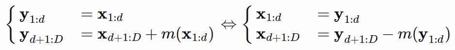

# Generative Flow Network project

In this project we explore Generative Flow Networks. We concentrate on NICE and Real NVP models and their performance on classical MNIST dataset.

## Task

We want to use generative flow to generate images similar to the ones in MNIST. We try to implement and train NICE ourselves, basing on papers. Then we want to compare it with some known implementation of Real NVP, also trained by us and see, how far off we were. 

## Team
- Mateusz Basiak (choosing models, training, tuning hyperparameters)
- Adrianna Struzik (data preparation, documentation, repo mainentance)

## Tools

- Python 3.7
- TensorFlow 2.0
- Google Collab
- Github
- etc.

## Project Structure

    .
    ├── data/                   # dataset path
    ├── docs/                   # notebooks with project reports
    ├── models/                 # links to best models and their training logs
       ├── nice/
       └── real_nvp/
    └── src/                    # source code of the training and models

## Idea

We use two models - NICE and Real NVP. They are both flow models, which means that each of them has a family of flow functions *f*<sub>1</sub>, *f*<sub>2</sub>, ..., *f*<sub>n</sub>,. We want them to have two principles:
1) we want each *f*<sub>i</sub> to be a bijection and to be easily inversible,
2) as they are multivariable functions that also output vectors, we want each *f*<sub>i</sub> to have easy to calculate Jacobian determinant. The easiest way to do that is that the Jacobian matrix is either a lower-triangle matrix or an upper-triangle matrix.

The main idea is as follows: during training we give to our script sample **x** from MNIST (or, for that matter any other dataset), and they are proceeded through our flow functions in order: **x**<sub>1</sub> = *f*<sub>1</sub>(**x**), **x**<sub>2</sub> = *f*<sub>2</sub>(**x**<sub>1</sub>) and so on. At the end we get a variable **y** = **x**<sub>n</sub> that can have really complicated distribution, not resembling that of **x**. We want **y** to have normal distribution, therefore our loss is distance from our distribution to gaussian. We calculate it using *log likelihood*.

But what does it have to do with generating? After the training is over, we can use inverse of our network. That means that we can randomly draw some variable **z** from normal distribution and feed it to inverse of our network, as all operations were inversible. The result will be an image with disribution resembling that of our dataset, in this case a digit from MNIST.

## Models
### NICE

[NICE](https://arxiv.org/pdf/1410.8516.pdf) (Non-linear Independent Components Estimation) model uses simplest possible flow functions. In every layer some elements **x**<sub>1:d</sub> of input are just written to output, and to other **x**<sub>d:D</sub> some function *m* is applied. This takes as its input elements **x**<sub>1:d</sub> and can be added, mulpiplied or in other form interact with **x**<sub>d:D</sub>. Here is an example when **m** is added to the inputs (which is also the case in our implementation):



Of course positions on which there is identity are different between layers, especially between neighbouring ones. Here function **m** can be arbitrary, as we don't calculate its inversion. Therefore this function is the parameter that our model is learning.
As we can see simplicity of *f*<sub>i</sub> makes inversions simple and it also allows us to use log likelihood as out loss function.

### Real NVP

[Real NVP](https://arxiv.org/pdf/1605.08803.pdf) (Real-valued Non-Volume Preserving) model is similar to NICE. THe difference is that there are two functions **s,t** instead of **m**, and one of them is multiplied by input while the other one is added.


As we can see, it doesn't make calculating inversions any harder, it still allows us to use log likelihood as loss function. Only tradeoff we make here is better generating power for higher numer of parameters.

## Dataset

Our dataset is MNIST.


It is a dataset containing 70 000 black and white images of digits. Each image is 28x28 pixels, each pixel is represented as an integer in range from 0 (white) to 255 (black). Dataset is labeled and divided into 60 000 training set and 10 000 test set. As it is a very classical and vell known dataset, we didn't feel the need to change or modify it.

## Training

More details about models and training can be found in ```/src/model_name``` section.

