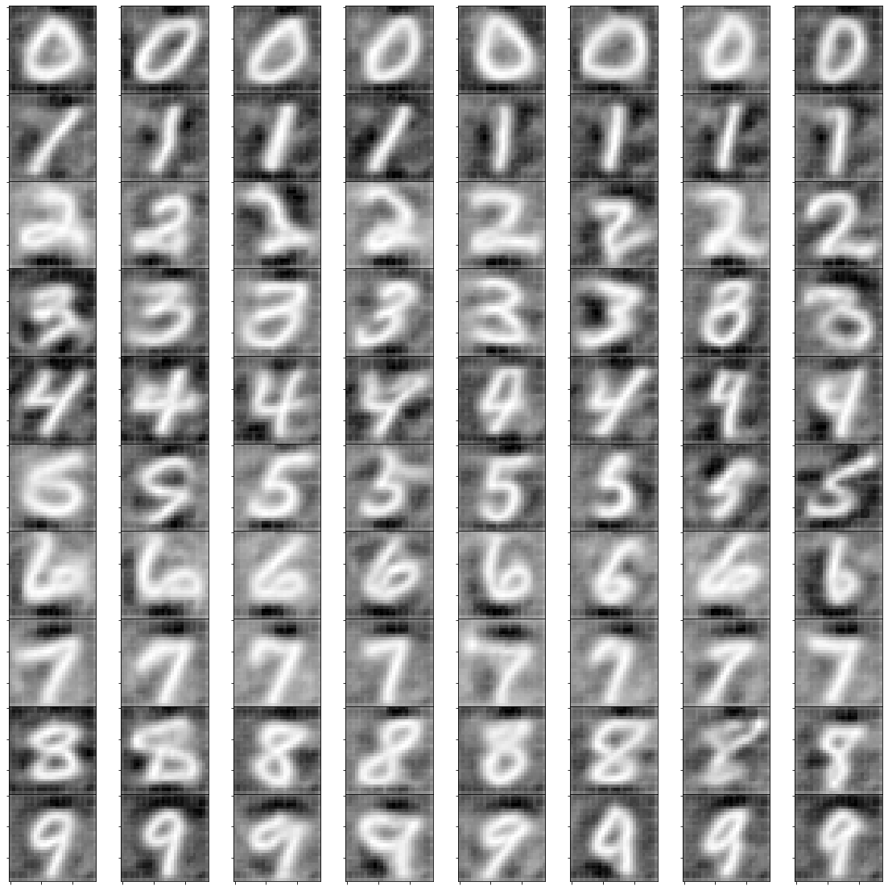

# NICE model

Model introduced [here](https://arxiv.org/pdf/1410.8516.pdf) by Dinh et. all. We wrote the code from scratch and tried to optimize it to get the best possible results in generating MNIST.

## Model overlook

NICE (Non-linear Independent Components Estimation) model uses simplest possible flow functions. In every layer some elements **x**<sub>1:d</sub> of input are just written to output, and to other **x**<sub>d:D</sub> some function *m* is applied. This takes as its input elements **x**<sub>1:d</sub> and can be added, mulpiplied or in other form interact with **x**<sub>d:D</sub>. Function **m** caan be added to inputs, multiplied or applied with any easily inversible operation. Here is an example when **m** is added to the inputs (which is also the case in our implementation):


Positions on which there is identity are different between layers, especially between neighbouring ones. Here function **m** can be arbitrary, as we don't calculate its inversion. Therefore this function is the parameter that our model is learning.
As we can see simplicity of *f*<sub>i</sub> makes inversions simple and it also allows us to use log likelihood as out loss function.

## Training 

This model requires MNIST dataset in standard format, as we have it in ```/data```. Functions from ```data_load.py``` clean it and prepare to the format understandable by the rest of the network. As they are incorporated into training code, the training can be done by one command:

```
python main.py
```

At the beginning of ```main.py``` file there are several parameters which can be changed to upgrade quality of results.

Our model has 6 blocks. In blocks with even numbers, the first half of inputs is written to output and to the second half we add **m** functions, in blocks with odd numbers it's the other way around. Each block contains two-layered neural network with ReLU activation function. Each layer has the same dimensions as the input (in this case half of the input, as we always feed to the block only half of the inputs). We trained our model through 10 epochs, with evaluation after each epoch. Results it returned are worse than Real NVP, but still satisfying.


