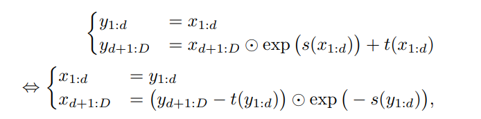

# Real NVP model

Model introduced [here](https://arxiv.org/pdf/1605.08803.pdf) by Dinh et. all. 
As it is more complex than NICE, we didn't write code ourselves, but instead downloaded it from [this](https://github.com/tensorflow/models/tree/archive/research/real_nvp) github repository.

## Model overlook

The idea of Real NVP (Real-value Non Volume Preserving) model is very similar to NICE models. They differ only on flow function, as instead of just one additive factor **m**, Real NVP introduces two factors **s, t**, where **s** is muliplicative.

Where &bigodot; is element-wise multiplication. As we can see above, introducing multiplication don't make inversing functions any harder, and yet it can vastly improve results.
