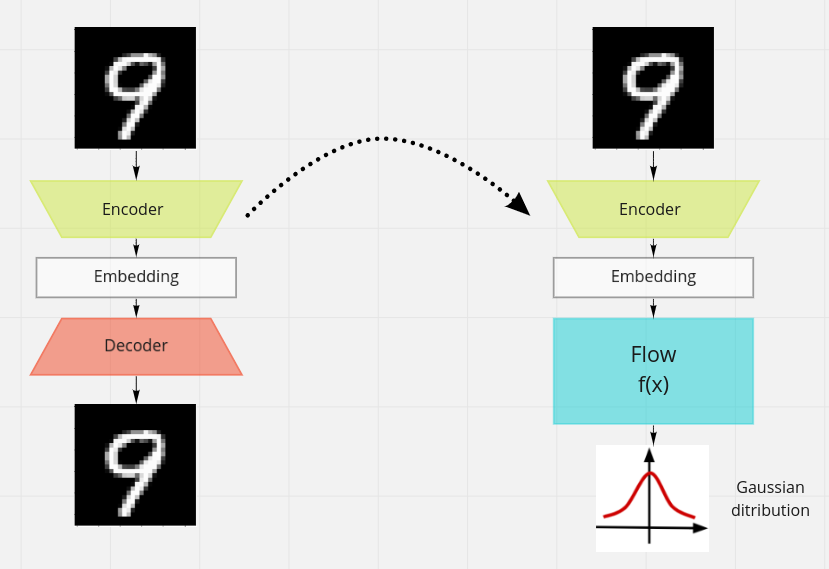
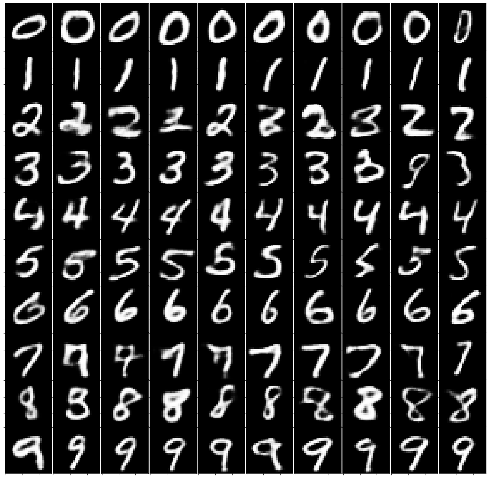

# Real NVP model

Model introduced [here](https://arxiv.org/pdf/1605.08803.pdf) by Dinh et. all. 
As it is more complex than NICE, we didn't write code ourselves, but instead downloaded code from [this](https://github.com/ispamm/realnvp-demo-pytorch) github repository and trained and fine-tuned the model ourselves.

## Model overlook

The idea of Real NVP (Real-value Non Volume Preserving) model is very similar to NICE models. They differ only on flow function, as instead of just one additive factor **m**, Real NVP introduces two factors **s, t**, where **s** is multiplicative.


Here &bigodot; is element-wise multiplication. As we can see above, introducing multiplication doesn't make inversing functions any harder, and yet it can improve results.

## Autoencoder

What is unique about the implementation we used is that it additionally trains autoencoder and uses autput of the encoder as input in training of Real NVP.



It turns out to vastly improve quality of generated content, as output from encoder is much closer to natural distributions and therefore easier to approximate by flow, than raw images. The most surprising thing is that even big reduction in number of dimensions of input doesn't hurt output results, as the network we settled on instead of standard MNIST 28x28 pictures outputs embeddings of size 20.

## Training 

As the model obtains its database from ```tensorflow.databases```, no additional data preparation is neccessary. Standard, 30 epoch long training can be started with

```
python main.py
```

We experimented with various numbers of layers and their sizes [all layers have the same size]. We settled on 9 layers, each of size 100, even though it turns out that above 6 layers differences aren't very big.
After a short training of 10 epochs for autoencoder and then 20 epochs for the model, we obtain good results for generating MNIST. Below are examples of generated digits.


